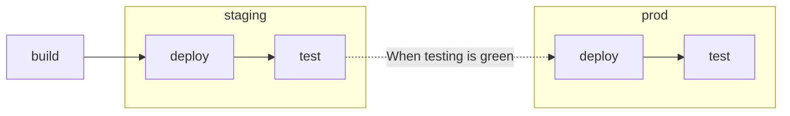
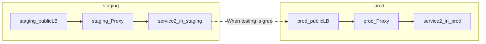
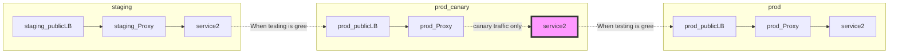
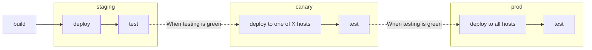
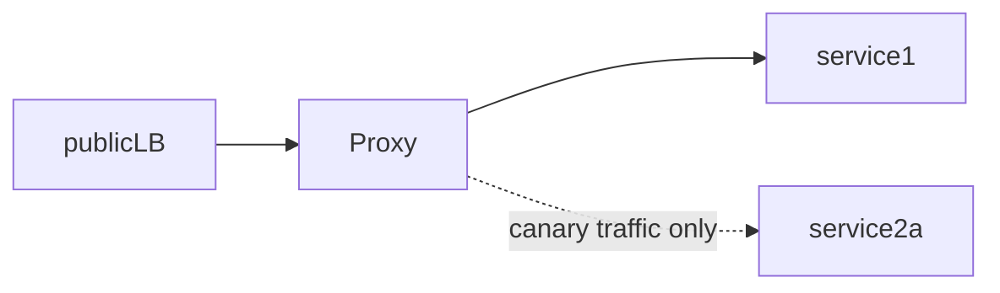
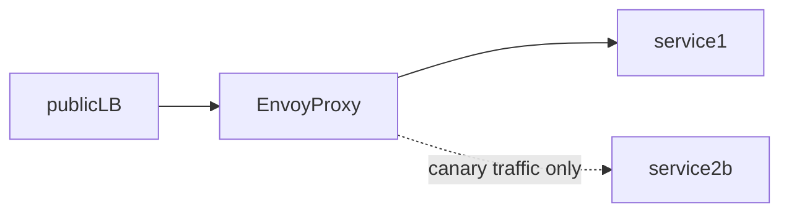
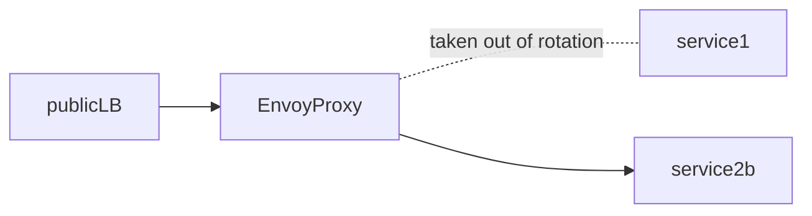
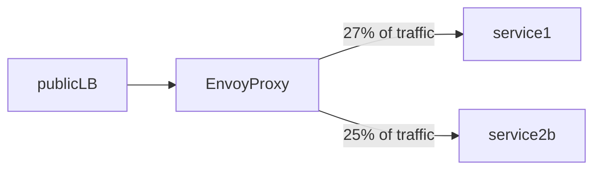

```mermaid
graph LR;
  build --> deploy
  subgraph staging
  deploy --> test
  end
  test -. When testing is green .->p
  subgraph prod
  p[deploy] --> t[test]
  end
```

```mermaid
graph LR;
  subgraph staging
  staging_publicLB --> staging_Proxy
  staging_Proxy --> service2_in_staging
  end
  service2_in_staging -. When testing is gree .->prod_publicLB
  subgraph prod
  prod_publicLB --> prod_Proxy
  prod_Proxy --> service2_in_prod
  end
```

```mermaid
graph LR;
  subgraph staging
  staging_publicLB --> staging_Proxy
  staging_Proxy --> Z[service2]
  end
  Z -. When testing is gree .->prod_publicLB
  subgraph prod_canary
  prod_publicLB --> prod_Proxy
  prod_Proxy-. canary traffic only .->service2
  end
  style service2 fill:#f9f,stroke:#333,stroke-width:4px
  service2 -. When testing is gree .->A
  subgraph prod
  A[prod_publicLB] --> B[prod_Proxy]
  B-->C[service2]
  end
```

## Canary testing

```mermaid
graph LR;
  build --> deploy
  subgraph staging
  deploy --> test
  end
  test -. When testing is green .->p
  subgraph canary
  p[deploy to one of X hosts] --> t[test]
  end
  t -. When testing is green .->p1
  subgraph prod
  p1[deploy to all hosts] --> t1[test]
  end

```

```mermaid
graph LR;
  publicLB --> Proxy
  Proxy --> service1
  Proxy-. canary traffic only .->service2a
```

```mermaid
graph LR;
  publicLB --> EnvoyProxy
  EnvoyProxy --> service1
  EnvoyProxy-. canary traffic only .->service2b
```

```mermaid
graph LR;
  publicLB --> EnvoyProxy
  EnvoyProxy -. taken out of rotation .-service1
  EnvoyProxy --> service2b
```

```mermaid
graph LR;
  publicLB --> EnvoyProxy
  EnvoyProxy -- 27% of traffic --> service1
  EnvoyProxy -- 25% of traffic --> service2b
```
